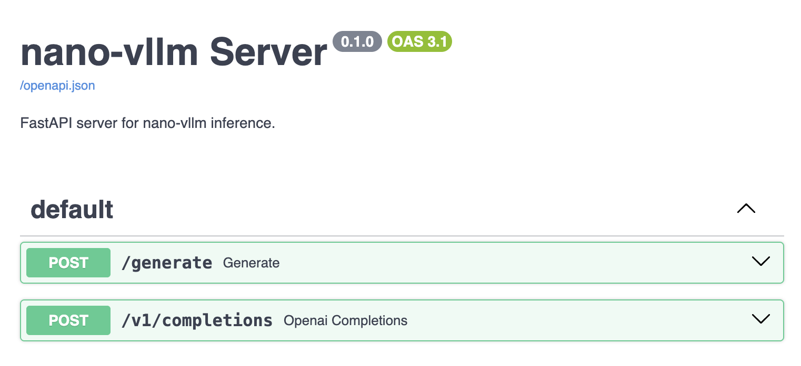

This repo contains Nano-vLLM with modifications for Mac MPS support and examples apps (i.e. openai compatible server).

<p align="center">
  
</p>


# Nano-vLLM

A lightweight vLLM implementation built from scratch.

## Key Features

* 🚀 **Fast offline inference** - Comparable inference speeds to vLLM
* 📖 **Readable codebase** - Clean implementation in ~ 1,200 lines of Python code
* ⚡ **Optimization Suite** - Prefix caching, Tensor Parallelism, Torch compilation, CUDA graph, etc.

## Installation

```bash
pip install git+https://github.com/GeeeekExplorer/nano-vllm.git
```

## Manual download

If you’d rather fetch the model weights yourself, you can use:
```bash
huggingface-cli download --resume-download Qwen/Qwen3-0.6B \
  --local-dir ~/huggingface/Qwen3-0.6B/ \
  --local-dir-use-symlinks False
```

## Quick Start

See `example.py` for usage. The API mirrors vLLM's interface with minor differences in the `LLM.generate` method.
```python
from nanovllm import LLM, SamplingParams
llm = LLM("/YOUR/MODEL/PATH", enforce_eager=True, tensor_parallel_size=1)
sampling_params = SamplingParams(temperature=0.6, max_tokens=256)
prompts = ["Hello, Nano-vLLM."]
outputs = llm.generate(prompts, sampling_params)
outputs[0]["text"]
```

## Benchmark

See `bench.py` for benchmark.

**Test Configuration:**
- Hardware: RTX 4070 Laptop (8GB)
- Model: Qwen3-0.6B
- Total Requests: 256 sequences
- Input Length: Randomly sampled between 100–1024 tokens
- Output Length: Randomly sampled between 100–1024 tokens

**Performance Results:**
| Inference Engine | Output Tokens | Time (s) | Throughput (tokens/s) |
|----------------|-------------|----------|-----------------------|
| vLLM           | 133,966     | 98.37    | 1361.84               |
| Nano-vLLM      | 133,966     | 93.41    | 1434.13               |


## Star History

[](https://www.star-history.com/#GeeeekExplorer/nano-vllm&Date)

## Contributing

### Project Documentation

- `MAINTENANCE.md` contains detailed information about project architecture, common issues, and best practices for code maintenance.
- `.github/copilot-instructions.md` provides specific guidance for GitHub Copilot to maintain consistency in code style and implementation patterns when assisting with this project.

When contributing to this project, please review these documents to understand:
- The architecture of the KV cache block management system
- Attention implementation guidelines
- Proper tensor shape handling
- Device compatibility (CUDA/MPS) considerations
- Testing and benchmarking protocols