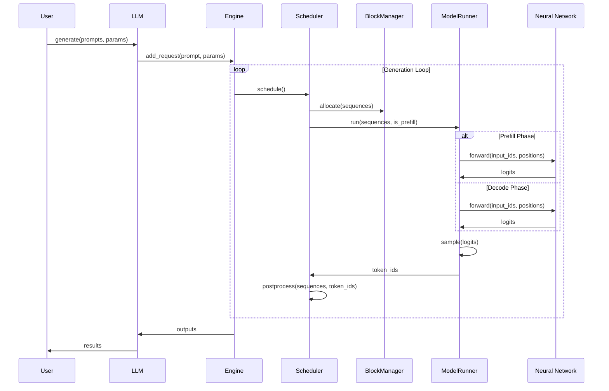
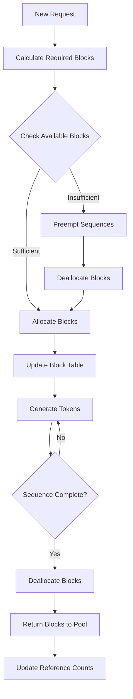
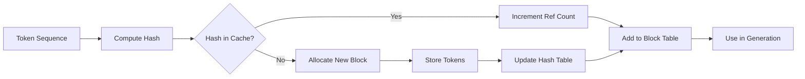
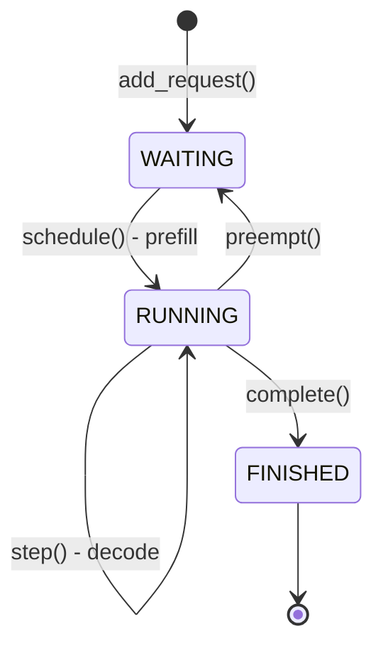
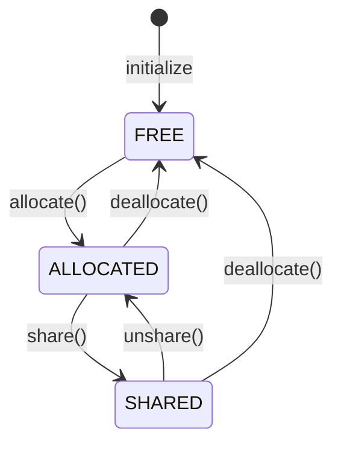
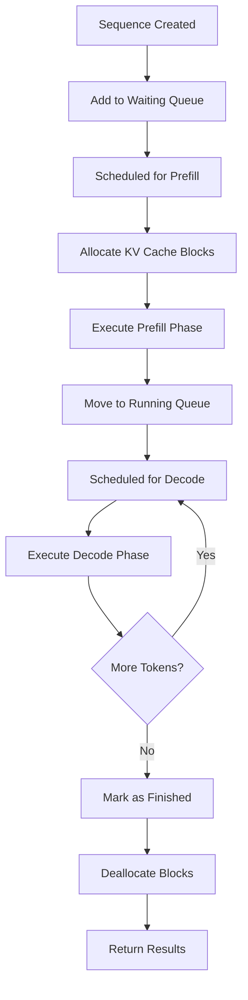
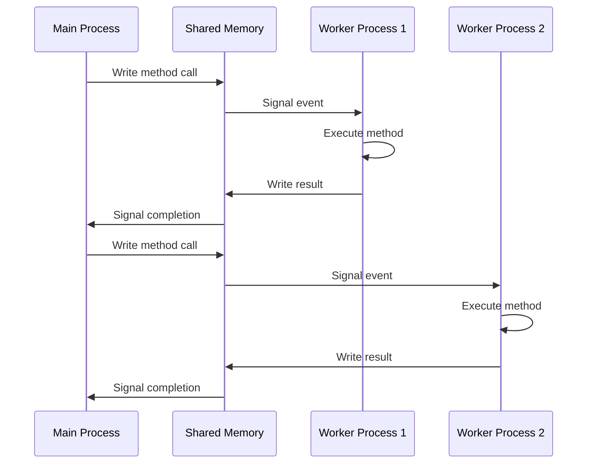

# Architecture Diagrams

This document contains detailed visual representations of Nano-vLLM's architecture, data flow, and component interactions.

## 🏗️ System Overview

### High-Level Architecture

```
┌─────────────────────────────────────────────────────────────────┐
│                        Nano-vLLM System                        │
├─────────────────────────────────────────────────────────────────┤
│                                                                 │
│  ┌─────────────────┐    ┌─────────────────┐    ┌─────────────┐ │
│  │   User Layer    │    │   Engine Layer  │    │ Model Layer │ │
│  │                 │    │                 │    │             │ │
│  │ • LLM Class     │◄──►│ • LLMEngine     │◄──►│ • Qwen3     │ │
│  │ • SamplingParams│    │ • ModelRunner   │    │ • Attention │ │
│  │ • Config        │    │ • Scheduler     │    │ • MLP       │ │
│  └─────────────────┘    │ • BlockManager  │    │ • Layers    │ │
│                         └─────────────────┘    └─────────────┘ │
│                                  │                       │      │
│                                  ▼                       ▼      │
│                         ┌─────────────────┐    ┌─────────────┐ │
│                         │   Memory Layer  │    │  CUDA Layer │ │
│                         │                 │    │             │ │
│                         │ • KV Cache      │    │ • Graphs    │ │
│                         │ • Block Manager │    │ • Kernels   │ │
│                         │ • Prefix Cache  │    │ • Memory    │ │
│                         └─────────────────┘    └─────────────┘ │
│                                                                 │
└─────────────────────────────────────────────────────────────────┘
```

### Component Interaction Flow

```
User Request
     │
     ▼
┌─────────────┐
│    LLM      │ ──► Public API Interface
│   Class     │
└─────────────┘
     │
     ▼
┌─────────────┐
│ LLMEngine   │ ──► Main Orchestrator
│             │     • Multi-process setup
│             │     • Request lifecycle
│             │     • Resource management
└─────────────┘
     │
     ▼
┌─────────────┐
│ Scheduler   │ ──► Request Scheduling
│             │     • Prefill phase
│             │     • Decode phase
│             │     • Preemption logic
└─────────────┘
     │
     ▼
┌─────────────┐
│BlockManager │ ──► Memory Management
│             │     • KV cache allocation
│             │     • Prefix caching
│             │     • Reference counting
└─────────────┘
     │
     ▼
┌─────────────┐
│ModelRunner  │ ──► Model Execution
│             │     • CUDA operations
│             │     • Graph optimization
│             │     • Multi-GPU coordination
└─────────────┘
     │
     ▼
┌─────────────┐
│   Model     │ ──► Neural Network
│  (Qwen3)    │     • Transformer layers
│             │     • Attention mechanism
│             │     • Tensor parallelism
└─────────────┘
```

## 🔄 Data Flow Diagrams

### Request Processing Flow



### Memory Management Flow



### KV Cache Management



## 🧠 Model Architecture

### Qwen3 Model Structure

```
Qwen3ForCausalLM
├── Qwen3Model
│   ├── VocabParallelEmbedding
│   │   └── Embedding Table (vocab_size × hidden_size)
│   │
│   ├── Qwen3DecoderLayer (× num_layers)
│   │   ├── Qwen3Attention
│   │   │   ├── QKVParallelLinear
│   │   │   │   └── QKV Projection (hidden_size → 3×hidden_size)
│   │   │   ├── Attention (Flash Attention)
│   │   │   │   ├── Q, K, V Split
│   │   │   │   ├── RoPE Positional Encoding
│   │   │   │   ├── Attention Computation
│   │   │   │   └── Output Concatenation
│   │   │   └── RowParallelLinear
│   │   │       └── Output Projection
│   │   │
│   │   └── Qwen3MLP
│   │       ├── MergedColumnParallelLinear
│   │       │   ├── Gate Projection (hidden_size → intermediate_size)
│   │       │   └── Up Projection (hidden_size → intermediate_size)
│   │       ├── SiLU Activation
│   │       └── RowParallelLinear
│   │           └── Down Projection (intermediate_size → hidden_size)
│   │
│   └── RMSNorm
│       └── Final Normalization
│
└── ParallelLMHead
    └── Output Projection (hidden_size → vocab_size)
```

### Tensor Parallelism Layout

```
┌─────────────────────────────────────────────────────────────┐
│                    Tensor Parallel Layout                   │
├─────────────────────────────────────────────────────────────┤
│                                                             │
│  GPU 0                    GPU 1                    GPU 2   │
│  ┌─────────────┐         ┌─────────────┐         ┌─────────┐ │
│  │   Head 0-7  │         │  Head 8-15  │         │Head 16-23│ │
│  │   KV 0-7    │         │   KV 8-15   │         │ KV 16-23│ │
│  │   MLP 0-1/3 │         │   MLP 1-2/3 │         │ MLP 2-3/3│ │
│  └─────────────┘         └─────────────┘         └─────────┘ │
│         │                       │                       │     │
│         └───────────────────────┼───────────────────────┘     │
│                                 │                             │
│  ┌─────────────────────────────────────────────────────────┐   │
│  │              All-Reduce Communication                   │   │
│  │              (NCCL Backend)                             │   │
│  └─────────────────────────────────────────────────────────┘   │
│                                                             │
└─────────────────────────────────────────────────────────────┘
```

## ⚡ Performance Optimization

### CUDA Graph Optimization

```
┌─────────────────────────────────────────────────────────────┐
│                    CUDA Graph Pipeline                      │
├─────────────────────────────────────────────────────────────┤
│                                                             │
│  ┌─────────────┐    ┌─────────────┐    ┌─────────────────┐ │
│  │   Capture   │───►│   Compile   │───►│     Execute     │ │
│  │   Phase     │    │   Phase     │    │     Phase       │ │
│  └─────────────┘    └─────────────┘    └─────────────────┘ │
│         │                   │                   │           │
│         ▼                   ▼                   ▼           │
│  ┌─────────────┐    ┌─────────────┐    ┌─────────────────┐ │
│  │ Record CUDA │    │ Optimize    │    │ Reuse Compiled  │ │
│  │ Operations  │    │ Kernel      │    │ Graph for       │ │
│  │ in Graph    │    │ Launch      │    │ Repeated Calls  │ │
│  └─────────────┘    └─────────────┘    └─────────────────┘ │
│                                                             │
└─────────────────────────────────────────────────────────────┘
```

### Memory Layout

```
┌─────────────────────────────────────────────────────────────┐
│                    GPU Memory Layout                        │
├─────────────────────────────────────────────────────────────┤
│                                                             │
│  ┌─────────────────────────────────────────────────────────┐ │
│  │                    Model Weights                        │ │
│  │  ┌─────────────┐  ┌─────────────┐  ┌─────────────────┐ │ │
│  │  │ Embedding   │  │ Attention   │  │      MLP        │ │ │
│  │  │   Tables    │  │   Weights   │  │    Weights      │ │ │
│  │  └─────────────┘  └─────────────┘  └─────────────────┘ │ │
│  └─────────────────────────────────────────────────────────┘ │
│                                                             │
│  ┌─────────────────────────────────────────────────────────┐ │
│  │                    KV Cache                             │ │
│  │  ┌─────────────┐  ┌─────────────┐  ┌─────────────────┐ │ │
│  │  │ Block 0     │  │ Block 1     │  │    Block N      │ │ │
│  │  │ [256 tokens]│  │ [256 tokens]│  │  [256 tokens]   │ │ │
│  │  └─────────────┘  └─────────────┘  └─────────────────┘ │ │
│  └─────────────────────────────────────────────────────────┘ │
│                                                             │
│  ┌─────────────────────────────────────────────────────────┐ │
│  │                  Working Memory                         │ │
│  │  ┌─────────────┐  ┌─────────────┐  ┌─────────────────┐ │ │
│  │  │ Input       │  │ Intermediate│  │     Output      │ │ │
│  │  │ Buffers     │  │   Results   │  │    Buffers      │ │ │
│  │  └─────────────┘  └─────────────┘  └─────────────────┘ │ │
│  └─────────────────────────────────────────────────────────┘ │
│                                                             │
└─────────────────────────────────────────────────────────────┘
```

## 🔧 Component Details

### Scheduler State Machine



### Block Manager States



### Sequence Lifecycle



## 📊 Performance Metrics

### Throughput Scaling

```
┌─────────────────────────────────────────────────────────────┐
│                    Throughput Scaling                       │
├─────────────────────────────────────────────────────────────┤
│                                                             │
│  Tokens/s                                                   │
│  6000 ┤                                                      │
│  5000 ┤                    ┌─────────────────┐              │
│  4000 ┤                   ╱                 ╲              │
│  3000 ┤                  ╱                   ╲              │
│  2000 ┤                 ╱                     ╲              │
│  1000 ┤                ╱                       ╲              │
│     0 ┼───────────────────────────────────────────────────── │
│        1 GPU    2 GPUs    4 GPUs    8 GPUs                  │
│                                                             │
└─────────────────────────────────────────────────────────────┘
```

### Memory Usage Patterns

```
┌─────────────────────────────────────────────────────────────┐
│                    Memory Usage Over Time                   │
├─────────────────────────────────────────────────────────────┤
│                                                             │
│  Memory (GB)                                                │
│    8 ┤                                                      │
│    6 ┤    ┌─────────────────────────────────────────┐       │
│    4 ┤   ╱                                           ╲      │
│    2 ┤  ╱                                             ╲     │
│    0 ┼───────────────────────────────────────────────────── │
│       0s    10s    20s    30s    40s    50s    60s         │
│                                                             │
│  ┌─ Model Weights  ─┐  ┌─ KV Cache ─┐  ┌─ Working ─┐      │
│                                                             │
└─────────────────────────────────────────────────────────────┘
```

## 🔄 Communication Patterns

### Multi-GPU Communication

```
┌─────────────────────────────────────────────────────────────┐
│                Multi-GPU Communication                      │
├─────────────────────────────────────────────────────────────┤
│                                                             │
│  GPU 0              GPU 1              GPU 2               │
│  ┌─────────┐        ┌─────────┐        ┌─────────┐         │
│  │ Process │        │ Process │        │ Process │         │
│  │   0     │        │   1     │        │   2     │         │
│  └─────────┘        └─────────┘        └─────────┘         │
│       │                   │                   │             │
│       └───────────────────┼───────────────────┘             │
│                           │                                 │
│  ┌─────────────────────────────────────────────────────────┐ │
│  │              Shared Memory (SHM)                        │ │
│  │  ┌─────────────┐  ┌─────────────┐  ┌─────────────────┐ │ │
│  │  │ Method Name │  │   Args      │  │    Results      │ │ │
│  │  └─────────────┘  └─────────────┘  └─────────────────┘ │ │
│  └─────────────────────────────────────────────────────────┘ │
│                                                             │
│  ┌─────────────────────────────────────────────────────────┐ │
│  │              NCCL Communication                         │ │
│  │  ┌─────────────┐  ┌─────────────┐  ┌─────────────────┐ │ │
│  │  │ All-Reduce  │  │ All-Gather  │  │   Broadcast     │ │ │
│  │  └─────────────┘  └─────────────┘  └─────────────────┘ │ │
│  └─────────────────────────────────────────────────────────┘ │
│                                                             │
└─────────────────────────────────────────────────────────────┘
```

### Inter-Process Communication



These diagrams provide comprehensive visual representations of Nano-vLLM's architecture, helping developers understand the system design, data flow, and component interactions. 