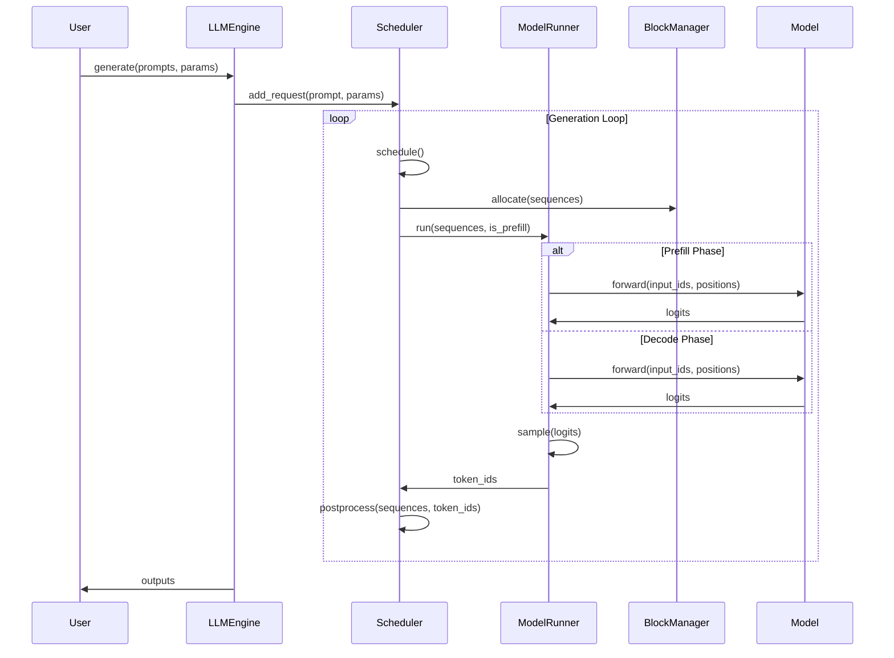
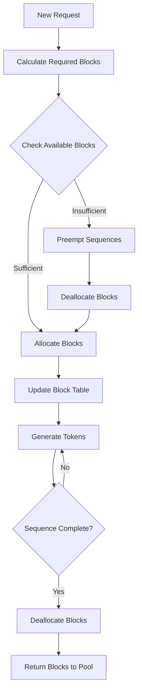
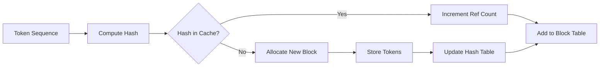

# Architecture Overview

Nano-vLLM is designed as a high-performance, lightweight inference engine for large language models. This document provides a detailed overview of the system architecture, component interactions, and design principles.

## 🏗️ System Architecture

### High-Level Design

```
┌─────────────────┐    ┌─────────────────┐    ┌─────────────────┐
│   User Input    │    │   LLM Engine    │    │   Model Layer   │
│                 │───▶│                 │───▶│                 │
│ - Prompts       │    │ - Scheduler     │    │ - Qwen3 Model   │
│ - Parameters    │    │ - Block Manager │    │ - Attention     │
└─────────────────┘    │ - Model Runner  │    │ - MLP Layers    │
                       └─────────────────┘    └─────────────────┘
                                │                       │
                                ▼                       ▼
                       ┌─────────────────┐    ┌─────────────────┐
                       │   KV Cache      │    │   Layer Ops     │
                       │                 │    │                 │
                       │ - Block-based   │    │ - Flash Attn    │
                       │ - Prefix Cache  │    │ - Tensor Parallel│
                       │ - Ref Counting  │    │ - CUDA Graphs   │
                       └─────────────────┘    └─────────────────┘
```

## 🔧 Core Components

### 1. Engine Layer (`nanovllm/engine/`)

The engine layer orchestrates the entire inference process and manages system resources.

#### LLMEngine (`llm_engine.py`)
**Purpose**: Main orchestrator and public API entry point

**Key Responsibilities**:
- Multi-process tensor parallelism setup
- Request lifecycle management
- Token generation loop coordination
- Resource cleanup and shutdown

**Key Methods**:
```python
class LLMEngine:
    def __init__(self, model, **kwargs)  # Initialize with model and config
    def add_request(self, prompt, sampling_params)  # Queue new requests
    def step(self)  # Execute one generation step
    def generate(self, prompts, sampling_params)  # High-level generation API
```

#### ModelRunner (`model_runner.py`)
**Purpose**: Handles actual model execution and GPU operations

**Key Responsibilities**:
- CUDA graph optimization for decode phase
- KV cache allocation and management
- Prefill/decode phase preparation
- Multi-GPU coordination via shared memory

**Key Features**:
- **CUDA Graph Capture**: Pre-compiles decode operations for efficiency
- **Memory Management**: Dynamic KV cache allocation based on GPU memory
- **Multi-GPU Support**: Inter-process communication via shared memory
- **Warmup**: Pre-allocates memory and warms up CUDA kernels

#### Scheduler (`scheduler.py`)
**Purpose**: Manages request scheduling and batching

**Key Responsibilities**:
- Prefill phase: Efficiently batch new requests
- Decode phase: Manage ongoing generation sequences
- Preemption: Handle memory pressure gracefully

**Scheduling Strategy**:
```python
def schedule(self) -> tuple[list[Sequence], bool]:
    # Prefill phase: batch new requests up to max_num_batched_tokens
    # Decode phase: continue existing sequences
    # Return: (scheduled_sequences, is_prefill_phase)
```

#### BlockManager (`block_manager.py`)
**Purpose**: Advanced KV cache management with prefix caching

**Key Features**:
- **Block-based Allocation**: 256-token blocks for efficient memory usage
- **Prefix Caching**: Hash-based deduplication of common token sequences
- **Reference Counting**: Share cache blocks between sequences with common prefixes
- **Hash-based Lookup**: Fast cache hit detection using xxHash

**Block Structure**:
```python
class Block:
    def __init__(self, block_id):
        self.block_id = block_id
        self.ref_count = 0      # Reference counting for sharing
        self.hash = -1          # Hash for prefix caching
        self.token_ids = []     # Actual token sequence
```

#### Sequence (`sequence.py`)
**Purpose**: Represents individual generation requests

**Key Properties**:
- `token_ids`: Generated tokens
- `block_table`: KV cache block assignments
- `status`: Current state (WAITING, RUNNING, FINISHED)
- `sampling_params`: Generation parameters

### 2. Model Layer (`nanovllm/models/`)

Currently supports Qwen3 models with a clean, modular implementation.

#### Qwen3ForCausalLM (`qwen3.py`)
**Purpose**: Complete model implementation with tensor parallelism

**Architecture**:
```
Qwen3ForCausalLM
├── Qwen3Model
│   ├── VocabParallelEmbedding
│   ├── Qwen3DecoderLayer (× num_layers)
│   │   ├── Qwen3Attention
│   │   │   ├── QKVParallelLinear
│   │   │   ├── Attention (Flash Attention)
│   │   │   └── RowParallelLinear
│   │   └── Qwen3MLP
│   │       ├── MergedColumnParallelLinear
│   │       └── RowParallelLinear
│   └── RMSNorm
└── ParallelLMHead
```

**Key Features**:
- **Tensor Parallelism**: Distributed across multiple GPUs
- **Flash Attention**: Optimized attention computation
- **Fused Operations**: Merged linear layers for efficiency

### 3. Layer Components (`nanovllm/layers/`)

Optimized neural network layers with tensor parallelism support.

#### Attention (`attention.py`)
**Purpose**: Multi-head attention with Flash Attention optimization

**Key Features**:
- Flash Attention for memory efficiency
- Support for grouped-query attention (GQA)
- Tensor parallelism across attention heads

#### Linear Layers (`linear.py`)
**Purpose**: Tensor-parallel linear transformations

**Types**:
- `QKVParallelLinear`: Parallel QKV projection
- `MergedColumnParallelLinear`: Fused gate/up projection
- `RowParallelLinear`: Row-parallel output projection

#### Embedding (`embed_head.py`)
**Purpose**: Vocabulary-parallel embedding and output projection

**Features**:
- Vocabulary sharding across GPUs
- Efficient lookup and projection operations

## 🔄 Data Flow

### 1. Request Processing Flow



### 2. Memory Management Flow



### 3. KV Cache Management



## 🎯 Design Principles

### 1. **Modularity**
- Clear separation of concerns between engine, model, and layer components
- Each component has a single, well-defined responsibility
- Easy to extend and modify individual components

### 2. **Efficiency**
- CUDA graph optimization for decode phase
- Block-based memory management for optimal GPU memory usage
- Prefix caching to avoid redundant computations
- Tensor parallelism for multi-GPU scaling

### 3. **Readability**
- Clean, well-documented code (~1,200 lines total)
- Consistent naming conventions and code structure
- Minimal dependencies and complexity

### 4. **Compatibility**
- Mirrors vLLM's API for easy adoption
- Standard HuggingFace model loading
- Familiar sampling parameters interface

## 🔧 Configuration

The system is configured through the `Config` class with key parameters:

```python
@dataclass
class Config:
    model: str                           # Model path
    max_num_batched_tokens: int = 16384  # Max tokens per batch
    max_num_seqs: int = 512              # Max concurrent sequences
    max_model_len: int = 4096            # Max sequence length
    gpu_memory_utilization: float = 0.9  # GPU memory usage
    tensor_parallel_size: int = 1        # Number of GPUs
    enforce_eager: bool = False          # Disable CUDA graphs
    kvcache_block_size: int = 256        # KV cache block size
```

## 🚀 Performance Optimizations

### 1. **CUDA Graph Optimization**
- Captures and reuses CUDA graphs for decode phase
- Reduces kernel launch overhead
- Significant performance improvement for repeated operations

### 2. **Prefix Caching**
- Hash-based deduplication of KV cache blocks
- Avoids redundant attention computations
- Memory efficient for similar prompts

### 3. **Block-based Memory Management**
- 256-token blocks for efficient allocation
- Reference counting for shared blocks
- Dynamic allocation based on available memory

### 4. **Tensor Parallelism**
- Distributes model across multiple GPUs
- Efficient inter-GPU communication
- Linear scaling with GPU count

This architecture achieves comparable performance to vLLM while maintaining a much simpler codebase, making it ideal for research, customization, and educational purposes. 